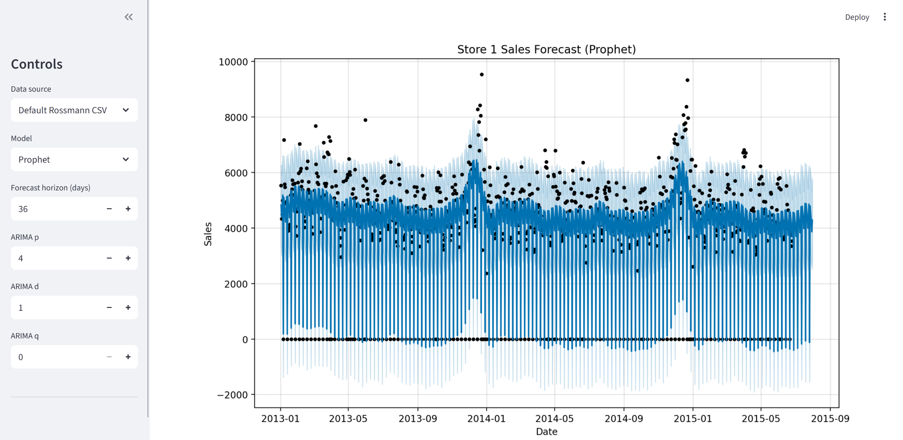
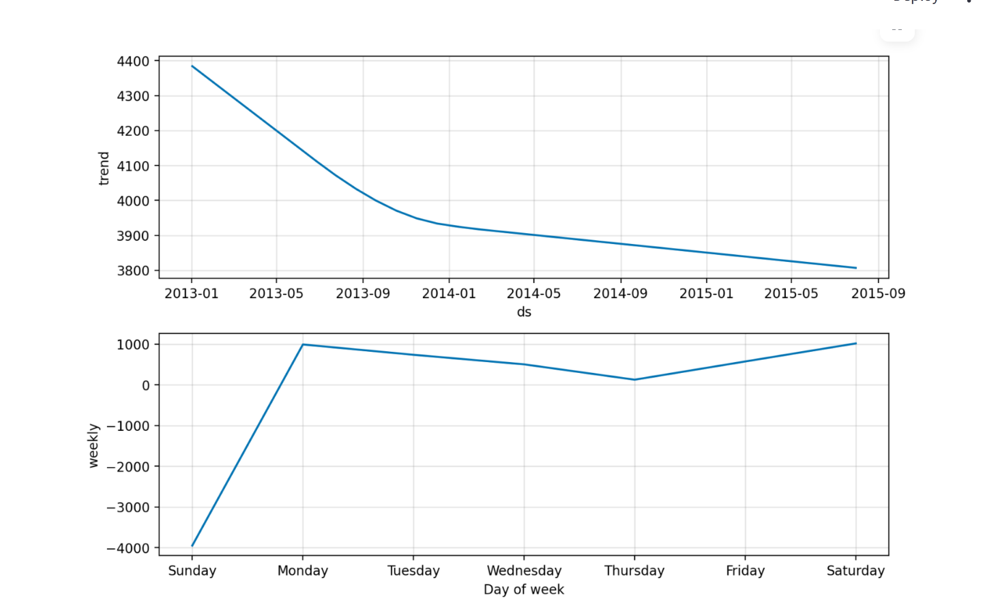
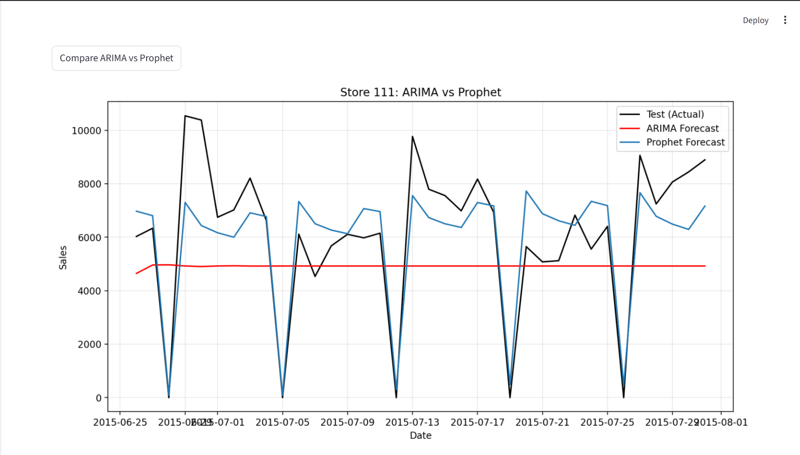
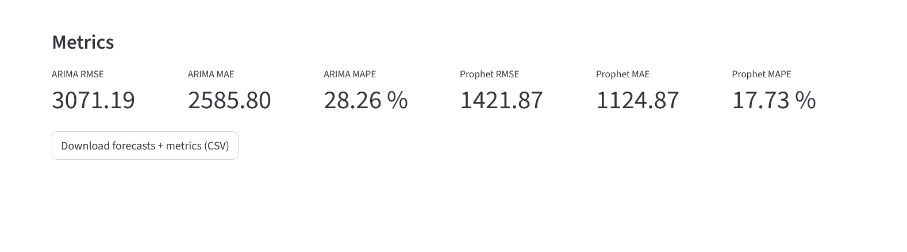

# Rossmann Forecast Dashboard

A modular Streamlit dashboard for forecasting retail sales using ARIMA and Prophet. Built for model comparison, multi-store analysis, and recruiter-grade visibility.

## 🔍 Features
- Single-store forecasting with ARIMA and Prophet
- Multi-store forecast comparison
- ARIMA vs Prophet side-by-side benchmarking
- RMSE, MAE, MAPE metrics
- CSV export of forecasts and metrics

## 📦 Tech Stack
- Python, Streamlit
- ARIMA (statsmodels), Prophet (Facebook)
- Matplotlib, Plotly
- scikit-learn, pandas, numpy

## 📸 Screenshots

### 🔹 Single Store Forecast


### 🔹 Prophet components



### 🔹 Prophet full components + metrics


### 🔹 Multi-store forecast comparison


### 🔹 Model comparison: ARIMA vs Prophet (Store 111)




## 🚀 How to Run
```bash
pip install -r requirements.txt
streamlit run app.py
