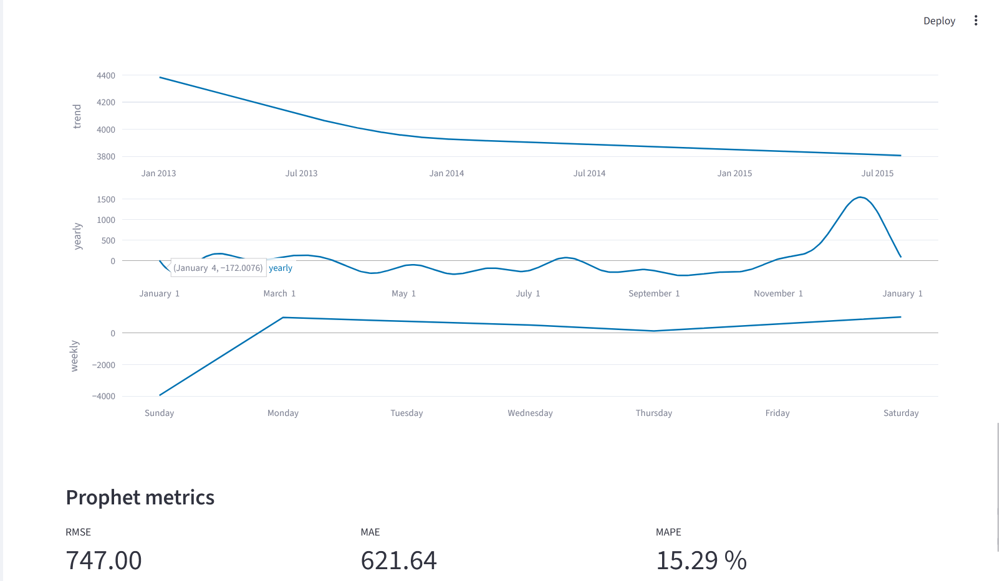
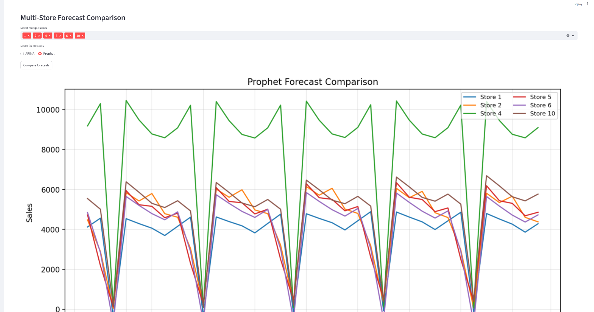
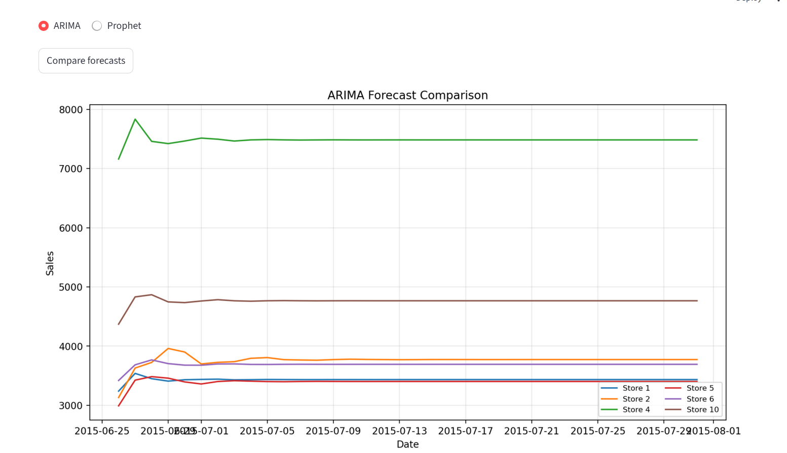

# Rossmann Forecast Dashboard

A modular Streamlit dashboard for forecasting retail sales using ARIMA and Prophet. Built for model comparison, multi-store analysis, and recruiter-grade visibility.

## 🔍 Features
- Single-store forecasting with ARIMA and Prophet
- Multi-store forecast comparison
- ARIMA vs Prophet side-by-side benchmarking
- RMSE, MAE, MAPE metrics
- CSV export of forecasts and metrics

## 📦 Tech Stack
- Python, Streamlit
- ARIMA (statsmodels), Prophet (Facebook)
- Matplotlib, Plotly
- scikit-learn, pandas, numpy

## 🚀 How to Run
```bash
pip install -r requirements.txt
streamlit run app.py

## 📸 Dashboard Screenshots

### 🔹 Single Store Forecast (Store 1)


### 🔹 Prophet Components
<table>
  <tr>
    <td></td>
    <td></td>
  </tr>
</table>

### 🔹 Prophet Full Components + Metrics


### 🔹 Multi-Store Forecast Comparison
<table>
  <tr>
    <td></td>
    <td></td>
  </tr>
</table>

### 🔹 Model Comparison: ARIMA vs Prophet (Store 111)
<table>
  <tr>
    <td></td>
    <td></td>
  </tr>
</table>

